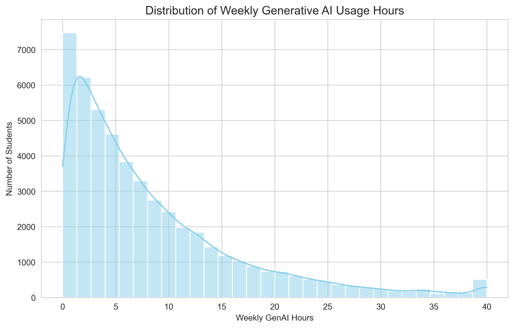
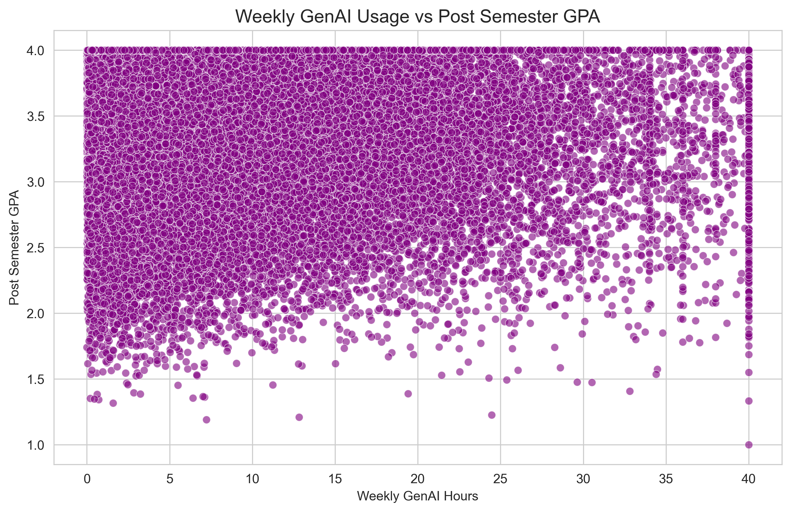
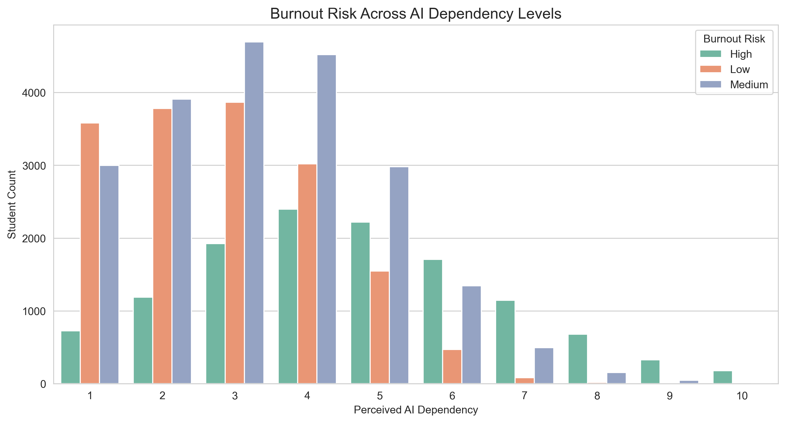
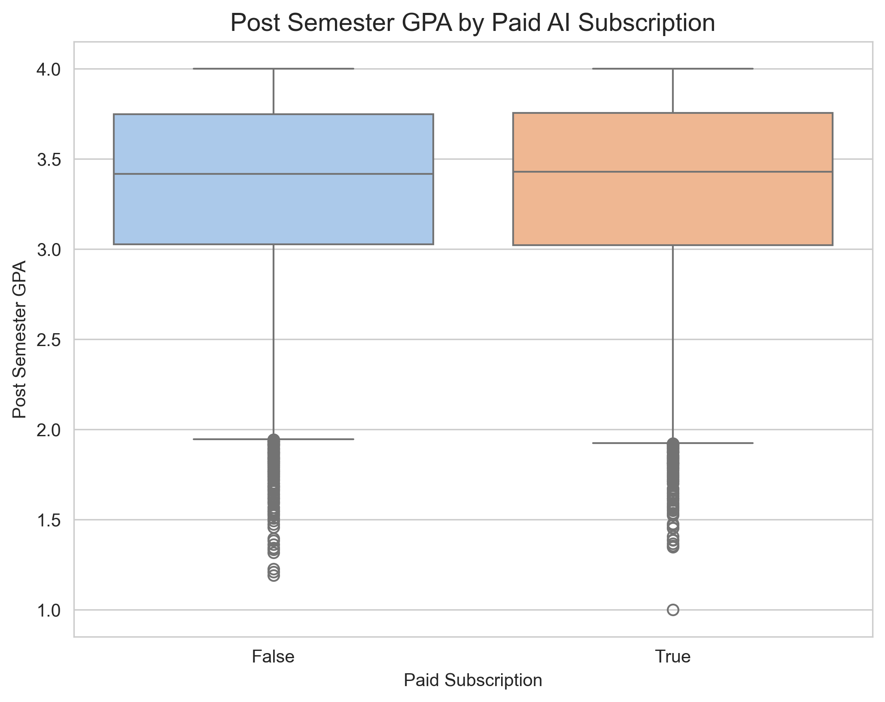
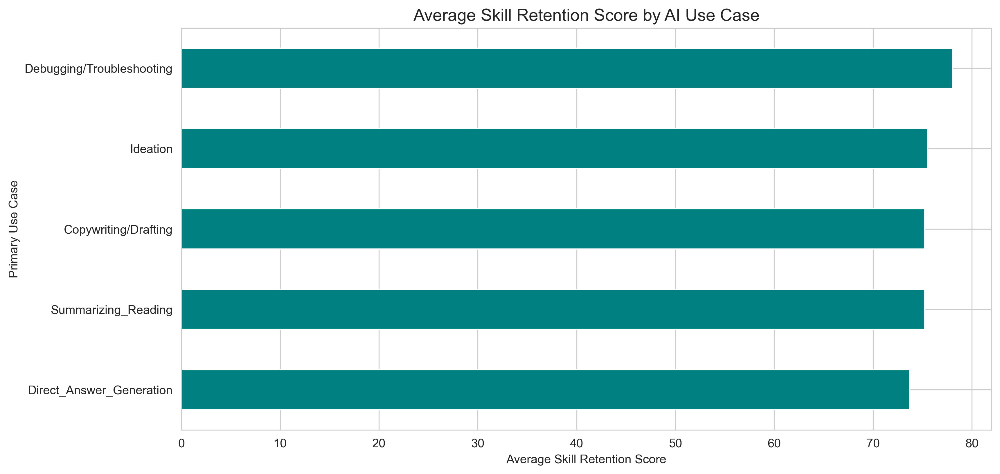
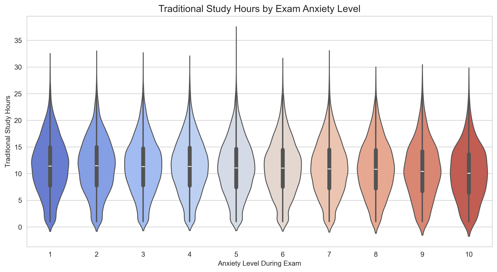
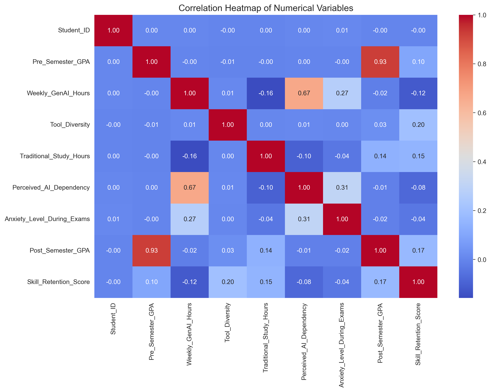

# 📊 AI Impact on Students - Exploratory Data Analysis


This repository contains a comprehensive Exploratory Data Analysis (EDA) of the **AI Impact on Students** dataset. The analysis explores how Generative AI tools affect university students' academic performance, study habits, burnout risk, and exam anxiety.

---

## 📂 Project Structure

```text
AI-Impact-on-Students-EDA/
│
├── data/
│   ├── ai_impact_students.csv          # Raw dataset
│   └── cleaned_ai_impact_students.csv  # Standardized and processed dataset
│
├── notebooks/
│   └── AI_Impact_on_Students_EDA.ipynb # Detailed step-by-step notebook
│
├── images/                             # Saved visualizations for the portfolio
│   ├── distribution_genai_usage.png
│   ├── ai_usage_vs_gpa.png
│   ├── burnout_dependency.png
│   ├── paid_subscription_boxplot.png
│   ├── skill_retention_bar.png
│   ├── anxiety_violinplot.png
│   └── correlation_heatmap.png
│
├── README.md
├── requirements.txt
├── .gitignore
└── LICENSE
```

---

## 🎯 Project Objectives

1. **Understand AI Usage Patterns:** Analyze weekly hours spent on Generative AI across different student profiles.
2. **Evaluate Academic Performance (GPA):** Examine correlations between AI usage hours and semester GPAs.
3. **Assess Burnout Risk & AI Dependency:** Observe if higher self-reported AI dependency triggers increased academic burnout risk.
4. **Compare Free vs. Paid Subscriptions:** Contrast academic performance between free users and premium AI tool subscribers.
5. **Explore Skill Retention:** Identify which AI use cases (e.g. coding, ideation, copywriting) retain skills best.
6. **Examine Exam Anxiety:** Investigate the relationship between traditional study hours and exam anxiety.

---

## 📈 Visualizations & Insights

### 1. Distribution of Weekly Generative AI Usage Hours
This chart displays how many hours per week students spend on Generative AI tools.


### 2. Weekly GenAI Usage vs. Post-Semester GPA
A scatterplot investigating whether extensive AI tool usage correlates positively or negatively with final GPAs.


### 3. Burnout Risk vs. AI Dependency Levels
A countplot showing how academic burnout risk corresponds to self-reported AI dependency scores.


### 4. Post-Semester GPA by Paid AI Subscription
A boxplot comparing the GPA distributions of students using free tools versus those paying for premium subscriptions.


### 5. Average Skill Retention Score by AI Use Case
This horizontal bar chart ranks different AI use cases (summarization, debugging, copywriting, ideation) by their associated average skill retention score.


### 6. Traditional Study Hours by Exam Anxiety Level
A violinplot illustrating the relationship between non-AI study habits and reported anxiety levels during exams.


### 7. Correlation Heatmap of Numerical Variables
A heatmap demonstrating relationships between numerical features such as traditional study hours, AI usage, GPA, anxiety, and skill retention.


---

## 🛠️ Installation & Usage

To run the analysis locally, follow these steps:

1. **Clone the Repository:**
   ```bash
   git clone https://github.com/piyushayy/AI-impact-on-student-analysis.git
   cd AI-impact-on-student-analysis
   ```

2. **Install Dependencies:**
   Make sure Python is installed, then run:
   ```bash
   pip install -r requirements.txt
   ```

3. **Open the Notebook:**
   Start Jupyter Notebook to explore the code:
   ```bash
   jupyter notebook notebooks/AI_Impact_on_Students_EDA.ipynb
   ```

---

## 📄 License
This project is licensed under the terms of the MIT License.
